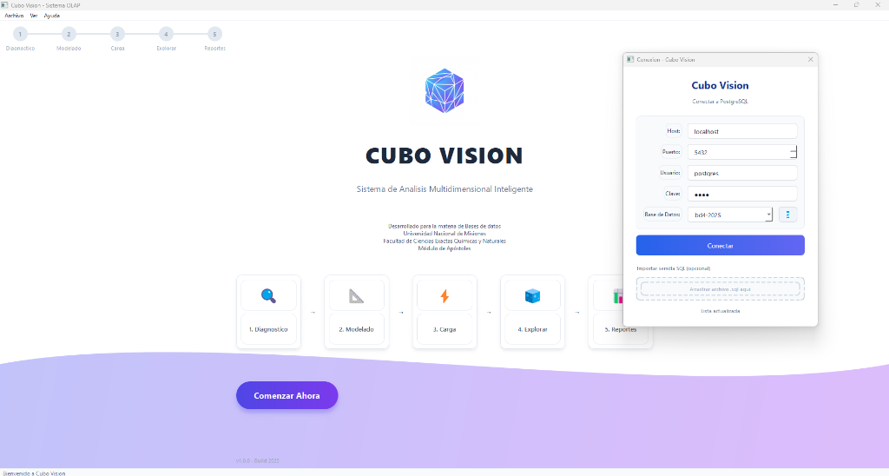
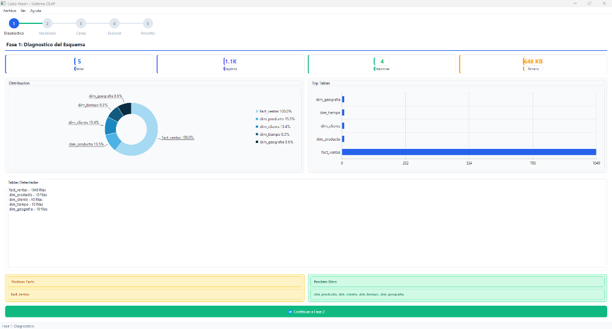
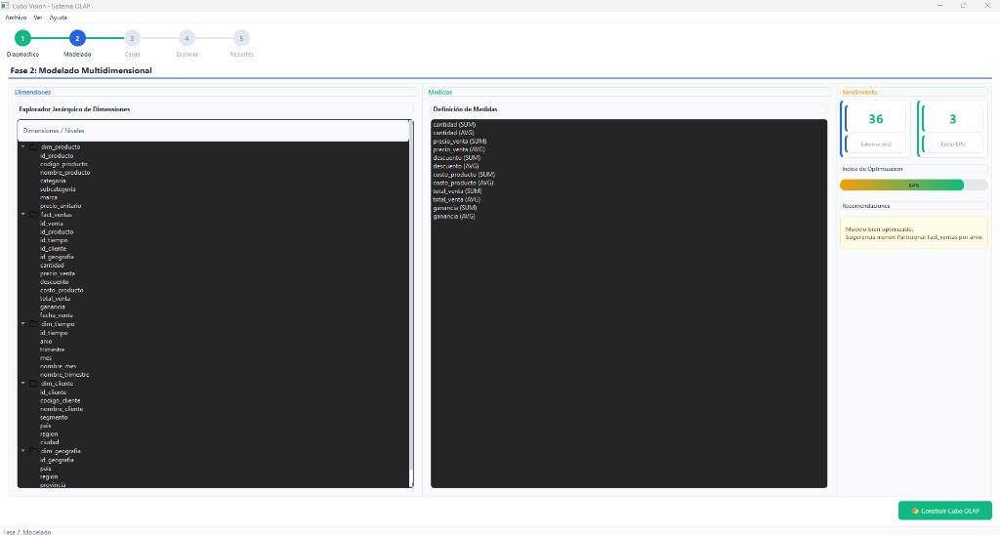
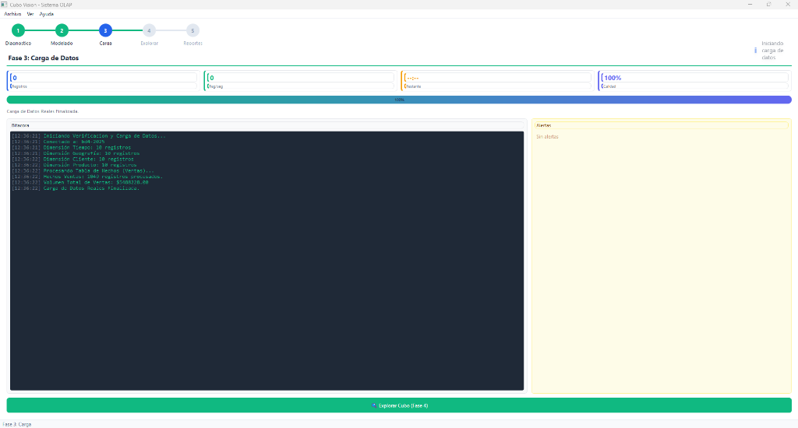
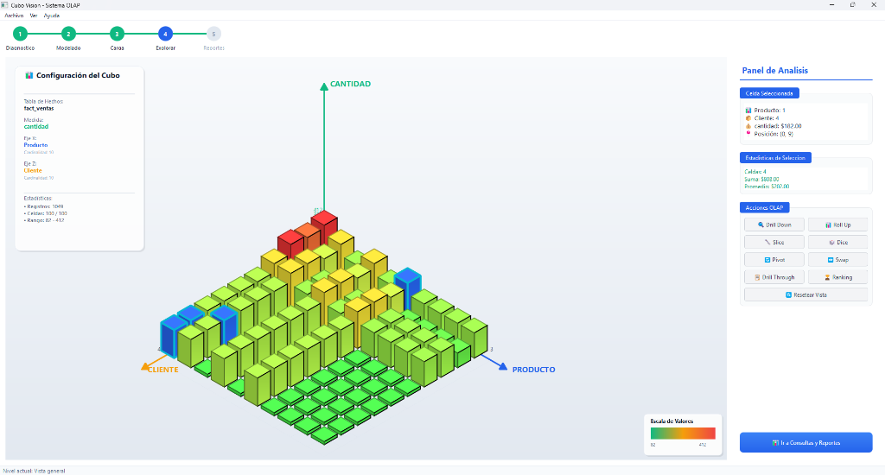

# CUBO VISION - Sistema OLAP Multidimensional

Sistema de análisis OLAP (Online Analytical Processing) con visualización 2.5D interactiva, desarrollado en C++20 con Qt 6.5 y PostgreSQL.

**Desarrollado para la materia de Bases de datos**  
**Universidad Nacional de Misiones**  
**Facultad de Ciencias Exactas Químicas y Naturales**  
**Módulo de Apóstoles**

---

## 📸 Capturas de Pantalla

### Pantalla de Inicio y Conexión


### Fase 1: Diagnóstico del Esquema


### Fase 2: Modelado Multidimensional


### Fase 3: Carga de Datos


### Fase 4: Visor OLAP 3D Interactivo


---

## 🎯 Descripción

Cubo Vision es una plataforma integral de análisis multidimensional que transforma bases de datos PostgreSQL en experiencias interactivas de análisis visual. El sistema guía al usuario a través de un flujo inteligente en 5 fases:

### 🔄 Proceso del Sistema

1. **🔍 Fase 1 - Diagnóstico Inteligente**
   - Conexión a PostgreSQL con validación de credenciales
   - Análisis automático del esquema de base de datos
   - Detección de tablas de hechos y dimensiones
   - Visualización de distribución de datos y relaciones
   - Sugerencias automáticas de modelado OLAP

2. **📐 Fase 2 - Modelado Multidimensional**
   - Exploración interactiva de dimensiones disponibles
   - Definición de medidas numéricas para análisis
   - Simulación de rendimiento del cubo
   - Validación de estructura multidimensional

3. **⚡ Fase 3 - Carga Optimizada**
   - Procesamiento de datos con monitoreo en tiempo real
   - Bitácora detallada de operaciones
   - Alertas de calidad de datos
   - Estadísticas de velocidad y progreso

4. **🧊 Fase 4 - Visualización 3D**
   - Exploración interactiva del cubo OLAP
   - Visualización isométrica 2.5D con QPainter
   - Panel de análisis con 8 operaciones OLAP
   - Selección de celdas y estadísticas en tiempo real

5. **📊 Fase 5 - Consultas y Reportes**
   - Constructor visual de consultas dinámicas
   - Detección automática de dimensiones y medidas
   - Generación de SQL optimizado
   - Exportación a CSV y PDF

---

## ✨ Características Principales

### Análisis Automático
- ✅ Detección automática de tablas de hechos y dimensiones
- ✅ Análisis de Foreign Keys y relaciones entre tablas
- ✅ Sugerencias inteligentes de modelado OLAP
- ✅ Validación de estructura multidimensional

### Visualización Avanzada
- ✅ Cubo 3D isométrico interactivo con QPainter
- ✅ Gráficos dinámicos con QtCharts (pastel, barras)
- ✅ Panel de análisis con estadísticas en tiempo real
- ✅ Selección de celdas y drill-down visual

### Operaciones OLAP
- ✅ **Drill Down** 🔍 - Profundizar en jerarquías
- ✅ **Roll Up** 📊 - Subir niveles de agregación
- ✅ **Slice** 🔪 - Filtrar por una dimensión
- ✅ **Dice** 🎲 - Filtros múltiples
- ✅ **Pivot** 🔄 - Rotar ejes del cubo
- ✅ **Swap** ↔️ - Intercambiar dimensiones
- ✅ **Drill Through** 📋 - Ver registros detallados
- ✅ **Ranking** 🏆 - Top N clasificación

### Interfaz Moderna
- ✅ Diseño limpio con tema blanco y acentos azules
- ✅ Emojis en botones para mejor UX
- ✅ Toasts de notificación no intrusivos
- ✅ Drag & drop para importar SQL
- ✅ Responsive y optimizado

---

## 🛠️ Requisitos del Sistema

### Software Requerido

- **Qt 6.5+** (Widgets, Sql, Charts, Gui, Core)
- **PostgreSQL 14+**
- **CMake 3.16+**
- **Compilador C++20** (MinGW 13+, MSVC 2022, GCC 11+)

### Dependencias de Qt

```cmake
Qt6::Widgets
Qt6::Sql
Qt6::Charts
Qt6::Gui
Qt6::Core
```

---

## 🚀 Instalación

### 1. Clonar el Repositorio

```bash
git clone https://github.com/lazamartinez/CUBOOLAP.git
cd CUBOOLAP
```

### 2. Configurar la Base de Datos

Crear la base de datos en PostgreSQL:

```sql
CREATE DATABASE bd2025;
```

Ejecutar la semilla de datos (opcional):

```bash
cd database
ejecutar_semilla.bat  # Windows
# o
./ejecutar_semilla.sh  # Linux/macOS
```

### 3. Compilar el Proyecto

#### Windows (Automático)

```batch
iniciar.bat
```

#### Linux/macOS

```bash
chmod +x iniciar.sh
./iniciar.sh
```

#### Manual con CMake

```bash
mkdir build && cd build
cmake .. -DCMAKE_PREFIX_PATH=/path/to/Qt/6.x.x/gcc_64
cmake --build . --config Release
./CuboVision
```

---

## 📁 Estructura del Proyecto

```
CUBOOLAP/
├── CMakeLists.txt              # Configuración CMake
├── iniciar.bat/sh              # Scripts de compilación
├── database/
│   ├── seed_bd4-2025.sql       # Datos de prueba (100K+ registros)
│   ├── ejecutar_semilla.bat    # Script de carga
│   └── README_BD4-2025.md      # Documentación de datos
├── docs/
│   ├── screenshots/            # Capturas de pantalla
│   ├── RESUMEN_TECNICO.md      # Documentación técnica
│   └── MANUAL_USUARIO.md       # Manual de usuario
└── src/
    ├── main.cpp
    ├── core/                   # Lógica de negocio
    │   ├── AnalizadorEsquema   # Análisis de BD
    │   ├── GestorBaseDatos     # Conexión PostgreSQL
    │   ├── GeneradorReportes   # Exportación
    │   └── MotorCarga          # Procesamiento de datos
    └── ui/                     # Interfaz de usuario
        ├── VentanaPrincipal    # Ventana principal
        ├── DialogoConexion     # Conexión a BD
        ├── DashboardReconocimiento  # Fase 1
        ├── EstudioModelado     # Fase 2
        ├── ConsolaProgreso     # Fase 3
        ├── VisorOlap           # Fase 4
        ├── PanelAnalisis       # Operaciones OLAP
        ├── ConstructorConsultas # Fase 5
        └── Estilos             # Temas y estilos
```

---

## 💡 Uso del Sistema

### Conexión Inicial

1. Ejecutar `CuboVision.exe`
2. Completar credenciales de PostgreSQL:
   - **Host**: localhost
   - **Puerto**: 5432
   - **Usuario**: postgres
   - **Contraseña**: (tu contraseña)
   - **Base de Datos**: bd4-2025

3. (Opcional) Arrastrar archivo `.sql` para importar datos

### Navegación por Fases

El sistema guía automáticamente a través de las 5 fases:

**Fase 1** → Revisar diagnóstico automático  
**Fase 2** → Confirmar dimensiones y medidas detectadas  
**Fase 3** → Monitorear carga de datos  
**Fase 4** → Explorar cubo OLAP interactivo  
**Fase 5** → Construir consultas personalizadas  

### Operaciones OLAP (Fase 4)

Todas las operaciones están disponibles en el **Panel de Análisis** (derecha):

- **Navegación**: Drill Down, Roll Up
- **Filtrado**: Slice, Dice
- **Transformación**: Pivot, Swap
- **Detalle**: Drill Through, Ranking
- **Reset**: Volver al estado inicial

---

## 📊 Datos de Prueba

El archivo `database/seed_bd4-2025.sql` genera:

| Tabla           | Registros | Descripción               |
| --------------- | --------- | ------------------------- |
| `dim_tiempo`    | 2,192     | Fechas 2020-2025          |
| `dim_geografia` | 463       | Ciudades de Latinoamérica |
| `dim_producto`  | 936       | Productos con categorías  |
| `dim_cliente`   | 5,000     | Clientes segmentados      |
| `fact_ventas`   | 100,000   | Transacciones de venta    |

**Total**: ~108,591 registros

---

## 🔧 Tecnologías Utilizadas

- **Lenguaje**: C++20
- **Framework UI**: Qt 6.5
- **Base de Datos**: PostgreSQL 14+
- **Gráficos**: QtCharts
- **Renderizado 2.5D**: QPainter (proyección isométrica)
- **Build System**: CMake 3.16+

---

## 📖 Documentación Adicional

- [Resumen Técnico](docs/RESUMEN_TECNICO.md) - Arquitectura y detalles técnicos
- [Manual de Usuario](docs/MANUAL_USUARIO.md) - Guía completa de uso
- [README Base de Datos](database/README_BD4-2025.md) - Estructura de datos

---

## 📝 Licencia

Este proyecto es de uso académico.

**Desarrollado para**: Bases de Datos  
**Universidad**: Universidad Nacional de Misiones (UNAM)  
**Facultad**: Ciencias Exactas, Químicas y Naturales  
**Módulo**: Apóstoles

---

## 👨‍💻 Autor

Proyecto desarrollado como trabajo práctico universitario.

---

## 🤝 Contribuciones

Las contribuciones son bienvenidas. Por favor, abra un issue para discutir cambios importantes antes de enviar un pull request.
