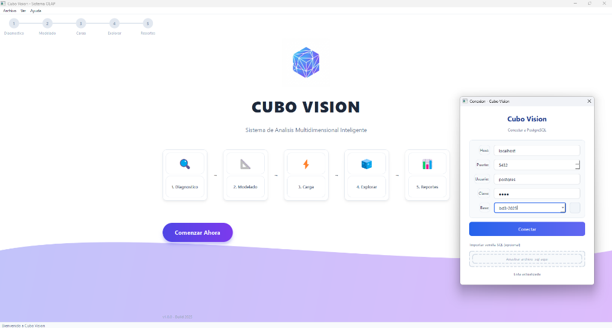
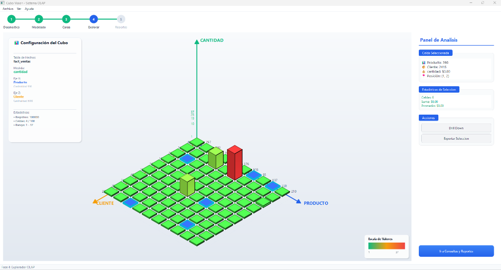

# CUBO VISION - Sistema OLAP Multidimensional

Sistema de analisis OLAP (Online Analytical Processing) con visualizacion 2.5D interactiva, desarrollado en C++20 con Qt 6.5 y PostgreSQL.

## Capturas de Pantalla

### Pantalla de Inicio y Conexion



### Visor OLAP 2.5D Interactivo



## Descripcion

Cubo Vision es una plataforma integral de analisis multidimensional que transforma bases de datos PostgreSQL en experiencias interactivas de analisis visual. El sistema guia al usuario a traves de un flujo inteligente en 5 fases:

1. **Diagnostico Inteligente**: Conexion y analisis automatico del esquema de base de datos
2. **Modelado Multidimensional**: Definicion visual de dimensiones, jerarquias y medidas
3. **Carga Optimizada**: Procesamiento paralelo con monitoreo de calidad de datos
4. **Visualizacion 2.5D**: Exploracion interactiva del cubo OLAP con graficos isometricos
5. **Consultas y Reportes**: Constructor visual de consultas y generacion de reportes

## Caracteristicas Principales

- Deteccion automatica de tablas de hechos y dimensiones
- Analisis de Foreign Keys y relaciones entre tablas
- Visualizacion isometrica 2.5D con QPainter
- Cubo denso interactivo con seleccion de celdas
- Panel de analisis con estadisticas en tiempo real
- Graficos interactivos con QtCharts
- Importacion de archivos SQL para poblar la base de datos
- Interfaz moderna con efecto glassmorphism
- Soporte completo para PostgreSQL

## Requisitos del Sistema

### Software Requerido

- Qt 6.5 o superior (Widgets, Sql, Charts, Gui, Core)
- PostgreSQL 14 o superior
- CMake 3.16 o superior
- Compilador C++20 compatible (MinGW 13+, MSVC 2022, GCC 11+)

### Dependencias de Qt

```
Qt6::Widgets
Qt6::Sql
Qt6::Charts
Qt6::Gui
Qt6::Core
```

## Instalacion

### 1. Clonar el Repositorio

```bash
git clone https://github.com/lazamartinez/CUBOOLAP.git
cd CUBOOLAP
```

### 2. Configurar la Base de Datos

Crear la base de datos en PostgreSQL:

```sql
CREATE DATABASE bd2025;
```

Ejecutar la semilla de datos (opcional, para datos de prueba):

```bash
psql -U postgres -d bd2025 -f db/semilla_completa.sql
```

### 3. Compilar el Proyecto

#### Windows (con Qt instalado)

```batch
iniciar.bat
```

#### Linux/macOS

```bash
chmod +x iniciar.sh
./iniciar.sh
```

#### Manual con CMake

```bash
mkdir build && cd build
cmake .. -DCMAKE_PREFIX_PATH=/path/to/Qt/6.x.x/gcc_64
cmake --build . --config Release
./CuboVision
```

## Estructura del Proyecto

```
CUBOOLAP/
├── CMakeLists.txt          # Configuracion de CMake
├── iniciar.bat             # Script de compilacion Windows
├── iniciar.sh              # Script de compilacion Linux/macOS
├── config/
│   └── db_config.ini       # Configuracion de conexion
├── db/
│   ├── semilla.sql         # Datos basicos de prueba
│   └── semilla_completa.sql # Datos completos (100K+ registros)
├── docs/
│   ├── screenshots/        # Capturas de pantalla
│   └── RESUMEN_TECNICO.md  # Documentacion tecnica
└── src/
    ├── main.cpp
    ├── core/               # Logica de negocio
    │   ├── AnalizadorEsquema.cpp/h
    │   ├── GestorBaseDatos.cpp/h
    │   ├── GeneradorReportes.cpp/h
    │   └── MotorCarga.cpp/h
    └── ui/                 # Interfaz de usuario
        ├── VentanaPrincipal.cpp/h
        ├── DialogoConexion.cpp/h
        ├── DashboardReconocimiento.cpp/h
        ├── EstudioModelado.cpp/h
        ├── VisorOlap.cpp/h
        ├── PanelAnalisis.cpp/h
        ├── ConstructorConsultas.cpp/h
        └── Estilos.h
```

## Uso del Sistema

### Conexion a la Base de Datos

1. Inicie la aplicacion ejecutando `CuboVision.exe`
2. Complete los campos de conexion:
   - Host: localhost (o IP del servidor)
   - Puerto: 5432
   - Usuario: postgres
   - Contrasena: (su contrasena)
   - Base de datos: bd2025

### Importar Datos de Semilla

El sistema permite importar archivos SQL para poblar la base de datos:

1. En el Dashboard de Diagnostico, haga clic en "Importar Semilla SQL"
2. Seleccione o arrastre el archivo .sql
3. El sistema ejecutara el script y mostrara el progreso

### Navegacion por Fases

- **Fase 1 - Diagnostico**: Revise el diagnostico automatico del esquema
- **Fase 2 - Modelado**: Defina dimensiones y medidas arrastrando columnas
- **Fase 3 - Carga**: Monitoree la carga de datos en tiempo real
- **Fase 4 - Explorador**: Explore el cubo OLAP en la visualizacion 2.5D
- **Fase 5 - Reportes**: Construya consultas y genere reportes

### Interaccion con el Visor OLAP

- **Click en celda**: Seleccionar/deseleccionar celda
- **Rueda del mouse**: Zoom in/out
- **Arrastrar**: Pan del cubo
- **Doble click**: Drill-down a nivel inferior
- **Tecla R**: Resetear vista
- **Tecla Esc**: Limpiar seleccion

## Datos de Prueba

El archivo `db/semilla_completa.sql` genera:

| Tabla         | Registros | Descripcion               |
| ------------- | --------- | ------------------------- |
| dim_tiempo    | 2,192     | Fechas 2020-2025          |
| dim_geografia | 463       | Ciudades de Latinoamerica |
| dim_producto  | 936       | Productos con categorias  |
| dim_cliente   | 5,000     | Clientes segmentados      |
| fact_ventas   | 100,000   | Transacciones de venta    |

## Configuracion

### Archivo db_config.ini

```ini
[Database]
Host=localhost
Port=5432
User=postgres
Password=laza
Database=bd2025
Driver=QPSQL
```

## Tecnologias Utilizadas

- **Lenguaje**: C++20
- **Framework UI**: Qt 6.5
- **Base de Datos**: PostgreSQL
- **Graficos**: QtCharts
- **Renderizado 2.5D**: QPainter con proyeccion isometrica
- **Build System**: CMake 3.16+

## Licencia

Este proyecto es de uso academico. Desarrollado para la cátedra Base de Datos. Universidad Nacional de Misiones (UNAM), Facultad de Ciencias Exactas, Química y Naturales. Módulo de Apóstoles.

## Autor

Proyecto desarrollado como trabajo practico universitario.

## Contribuciones

Las contribuciones son bienvenidas. Por favor, abra un issue para discutir cambios importantes antes de enviar un pull request.
