# CUBO VISION
## Manual de Usuario - Sistema OLAP Multidimensional

**Version:** 1.0  
**Fecha:** Diciembre 2025  
**Materia:** Base de Datos 2025

---

# Tabla de Contenidos

1. [Introduccion](#1-introduccion)
2. [Arquitectura del Sistema](#2-arquitectura-del-sistema)
3. [Requisitos e Instalacion](#3-requisitos-e-instalacion)
4. [Flujo de Trabajo en 5 Fases](#4-flujo-de-trabajo-en-5-fases)
5. [Guia de Uso Detallada](#5-guia-de-uso-detallada)
6. [Ventajas y Desventajas](#6-ventajas-y-desventajas)
7. [Conclusiones](#7-conclusiones)

---

# 1. Introduccion

## 1.1 Que es OLAP

OLAP (Online Analytical Processing) es una tecnologia que permite analizar datos multidimensionales de forma interactiva y rapida. A diferencia de los sistemas transaccionales (OLTP), OLAP esta optimizado para consultas complejas que involucran agregaciones, comparaciones temporales y analisis de tendencias.

### Comparacion OLTP vs OLAP

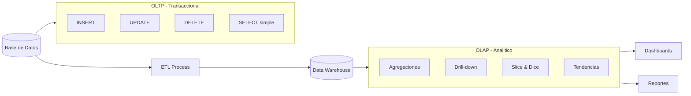

## 1.2 Que es Cubo Vision

Cubo Vision es una aplicacion de escritorio desarrollada en C++ con Qt 6.5 que permite:

- Conectarse a bases de datos PostgreSQL existentes
- Detectar automaticamente la estructura dimensional de los datos
- Visualizar los datos en un cubo OLAP 3D interactivo
- Explorar y analizar informacion de forma visual e intuitiva

### Vision General del Sistema

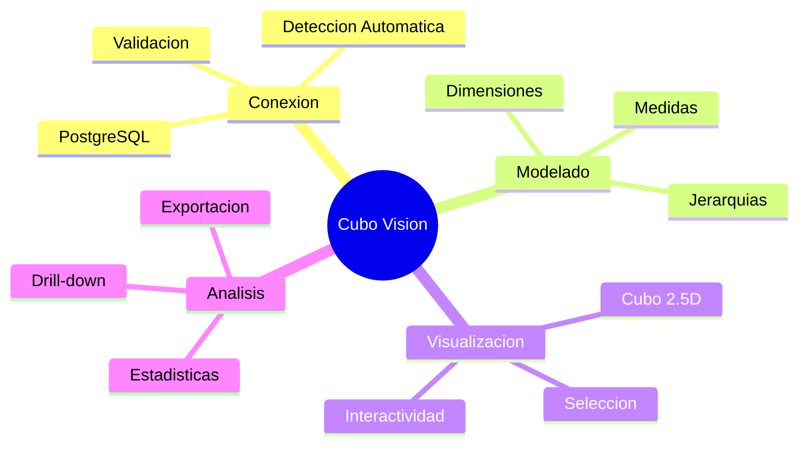

## 1.3 Proposito del Sistema

El sistema fue disenado para transformar bases de datos relacionales tradicionales en experiencias de analisis visual, permitiendo a usuarios sin conocimientos tecnicos profundos explorar grandes volumenes de datos de manera intuitiva.

## 1.4 Publico Objetivo

- Analistas de datos
- Gerentes y tomadores de decisiones
- Estudiantes de sistemas de informacion
- Cualquier usuario que necesite explorar datos dimensionales

---

# 2. Arquitectura del Sistema

## 2.1 Tecnologias Utilizadas

| Componente | Tecnologia | Justificacion |
|------------|------------|---------------|
| Lenguaje | C++20 | Alto rendimiento, control de memoria, ideal para graficos |
| Framework UI | Qt 6.5 | Multiplataforma, widgets nativos, excelente soporte para graficos 2D |
| Base de Datos | PostgreSQL | Robusto, escalable, excelente soporte SQL:1999 |
| Graficos | QPainter | Renderizado 2D eficiente sin dependencias externas |
| Visualizacion | QtCharts | Graficos estadisticos integrados con Qt |
| Build System | CMake | Estandar de la industria, multiplataforma |

## 2.2 Arquitectura en Capas

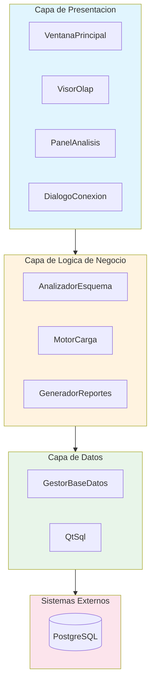

### Justificacion de la Arquitectura

Se eligio una arquitectura en capas porque:

1. **Separacion de responsabilidades**: Cada capa tiene una funcion especifica
2. **Mantenibilidad**: Cambios en una capa no afectan a las demas
3. **Testabilidad**: Cada capa puede probarse de forma independiente
4. **Escalabilidad**: Facilita agregar nuevas funcionalidades

## 2.3 Diagrama de Componentes

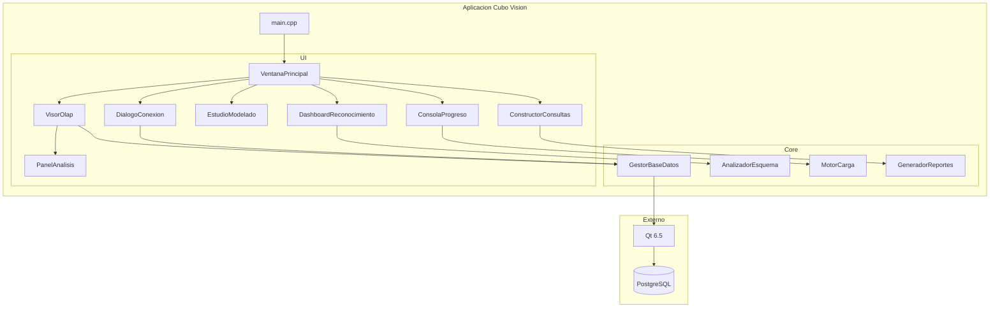

## 2.4 Porque C++ y Qt en lugar de tecnologias web

### Comparacion de Tecnologias

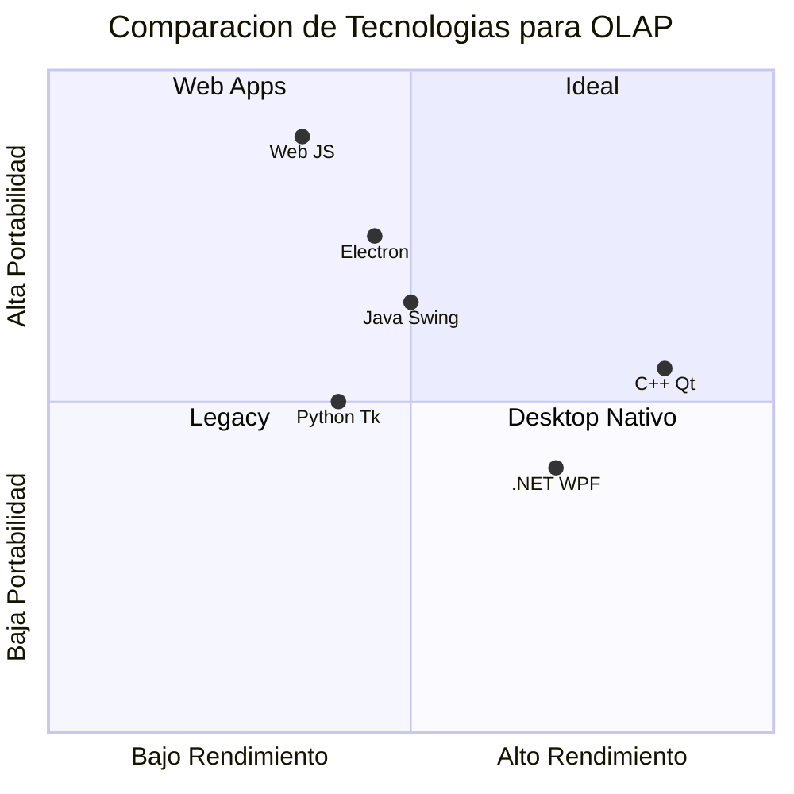

### Ventajas de la eleccion:

- **Rendimiento**: Renderizado de graficos 3D fluido sin latencia
- **Acceso directo a recursos**: Uso eficiente de memoria y CPU
- **Sin dependencia de internet**: Funciona completamente offline
- **Experiencia nativa**: Integracion perfecta con el sistema operativo

### Desventajas:

- **Portabilidad limitada**: Requiere compilacion por plataforma
- **Curva de aprendizaje**: C++ es mas complejo que JavaScript/Python
- **Distribucion**: Requiere empaquetado con dependencias Qt

---

# 3. Requisitos e Instalacion

## 3.1 Requisitos del Sistema

### Hardware Minimo
- Procesador: Intel Core i3 o equivalente
- RAM: 4 GB
- Espacio en disco: 500 MB
- Resolucion: 1280 x 720

### Hardware Recomendado
- Procesador: Intel Core i5 o superior
- RAM: 8 GB o mas
- SSD para mejor rendimiento
- Resolucion: 1920 x 1080

### Software Requerido
- Windows 10/11, Linux o macOS
- PostgreSQL 14 o superior
- Qt 6.5 o superior (para compilacion)

## 3.2 Proceso de Instalacion

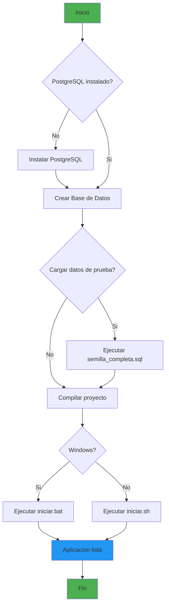

## 3.3 Instalacion Paso a Paso

### Paso 1: Preparar PostgreSQL

```sql
-- Crear la base de datos
CREATE DATABASE bd2025;
```

### Paso 2: Cargar Datos de Prueba (Opcional)

```bash
psql -U postgres -d bd2025 -f db/semilla_completa.sql
```

### Paso 3: Compilar y Ejecutar

**Windows:**
```batch
iniciar.bat
```

**Linux/macOS:**
```bash
./iniciar.sh
```

---

# 4. Flujo de Trabajo en 5 Fases

El sistema guia al usuario a traves de un flujo estructurado en 5 fases secuenciales.

## Diagrama General del Flujo

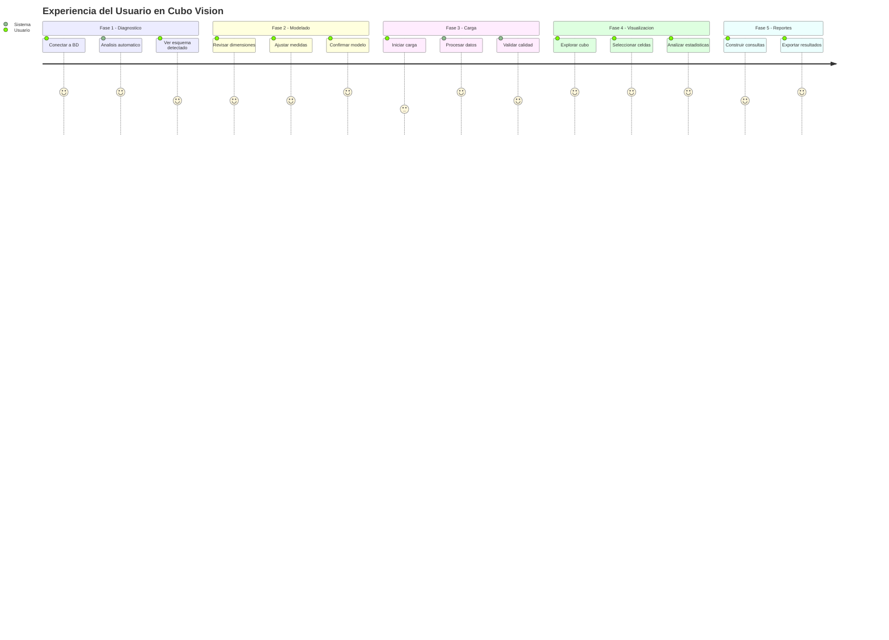

## 4.1 Fase 1: Diagnostico Inteligente

### Proposito
Conectar a la base de datos y analizar automaticamente su estructura para identificar tablas de hechos, dimensiones y relaciones.

### Flujo de Deteccion Automatica

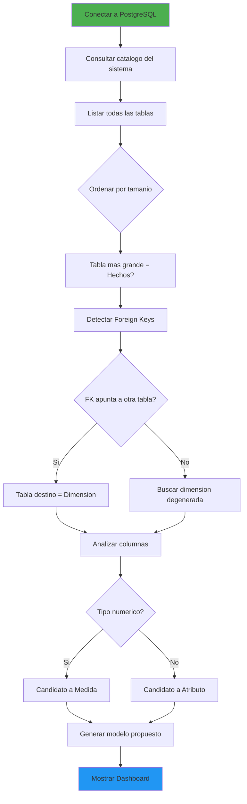

### Heuristica de Deteccion

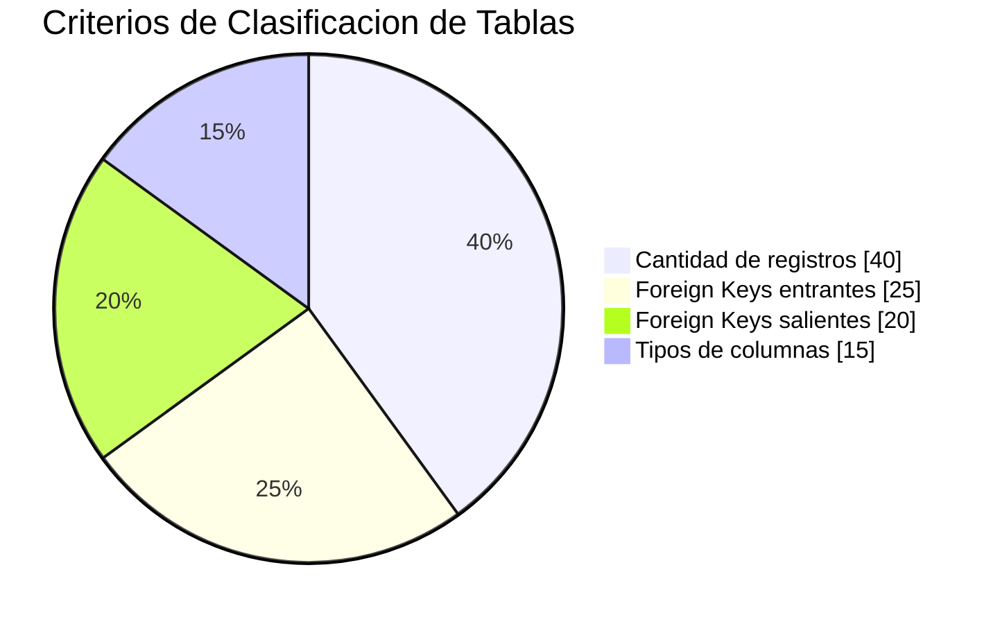

## 4.2 Fase 2: Modelado Multidimensional

### Proposito
Permitir al usuario revisar y ajustar el modelo dimensional detectado.

### Modelo Dimensional Estrella

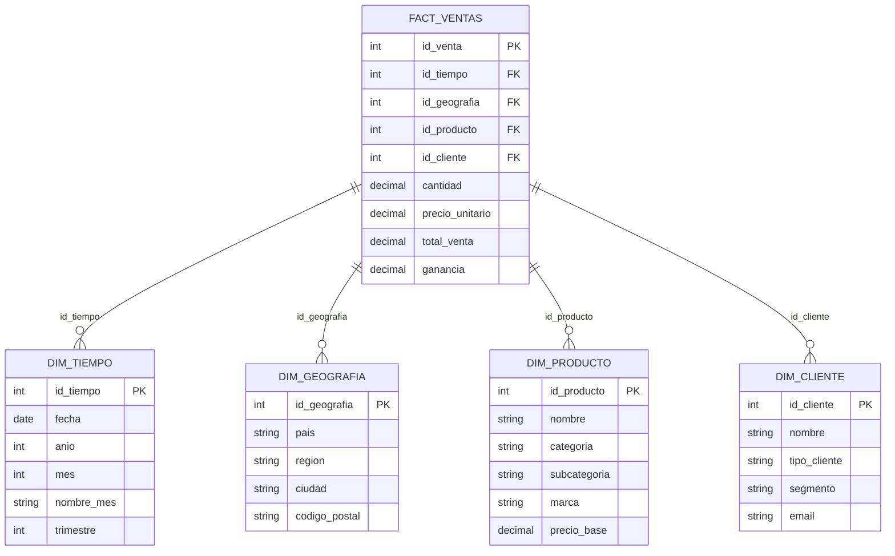

## 4.3 Fase 3: Carga Optimizada

### Proposito
Cargar los datos desde la base de datos relacional al modelo dimensional en memoria.

### Pipeline de Carga

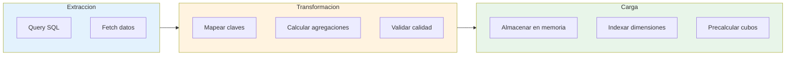

### Metricas de Progreso

```mermaid
gantt
    title Ejemplo de Carga de 100,000 Registros
    dateFormat ss
    axisFormat %S s
    
    section Extraccion
    Query inicial           :e1, 0, 2s
    Fetch dimensiones       :e2, after e1, 1s
    
    section Transformacion
    Mapeo de claves         :t1, after e2, 3s
    Agregaciones            :t2, after t1, 4s
    Validacion              :t3, after t2, 1s
    
    section Carga
    Indexacion              :l1, after t3, 2s
    Finalizacion            :l2, after l1, 1s
```

## 4.4 Fase 4: Visualizacion 2.5D

### Proposito
Presentar los datos en un cubo OLAP interactivo que permite exploracion visual intuitiva.

### Sistema de Coordenadas Isometrico

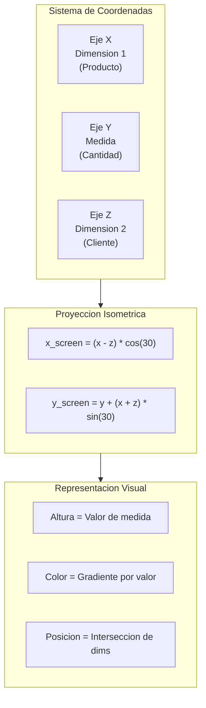

### Codificacion Visual

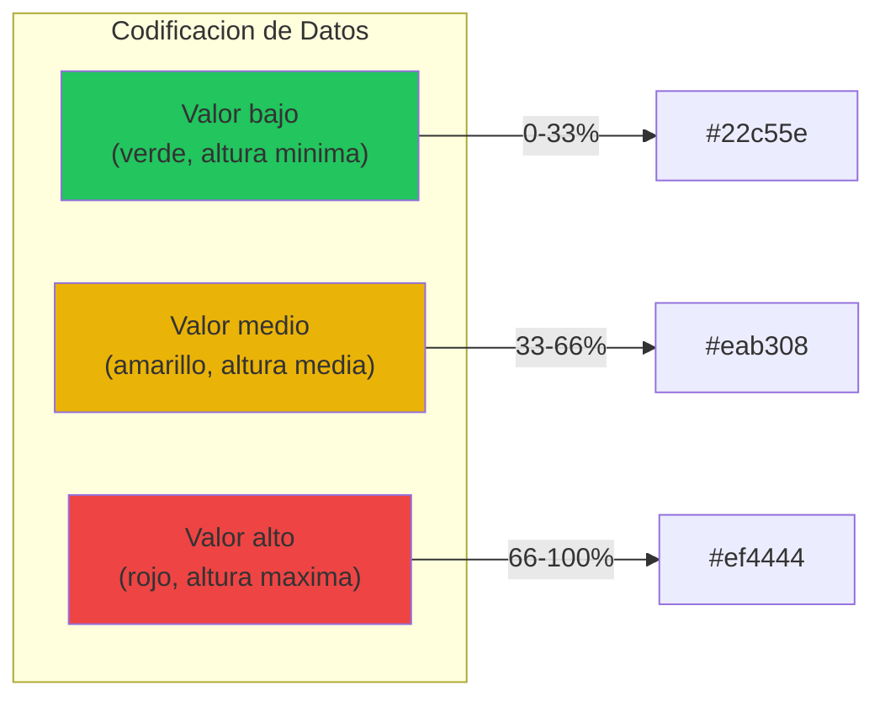

### Interacciones del Usuario

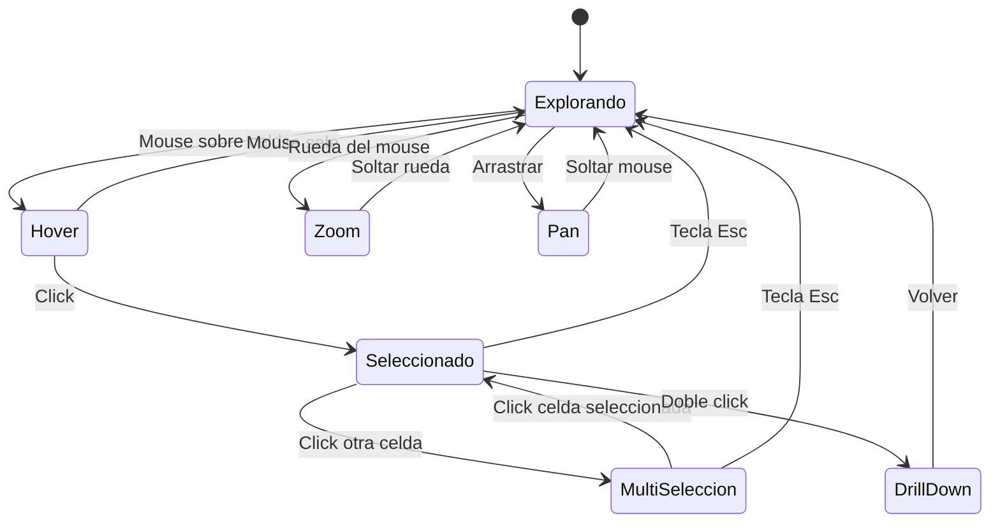

## 4.5 Fase 5: Consultas y Reportes

### Proposito
Permitir construccion de consultas personalizadas y generacion de reportes exportables.

### Flujo de Generacion de Reportes

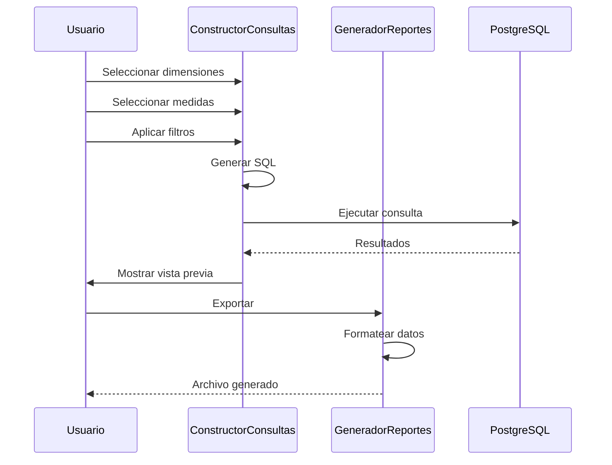

---

# 5. Guia de Uso Detallada

## 5.1 Flujo de Navegacion

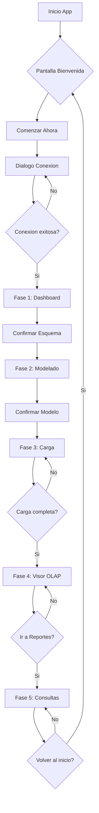

## 5.2 Atajos de Teclado

| Tecla | Funcion |
|-------|---------|
| R | Resetear vista a posicion inicial |
| Esc | Limpiar todas las selecciones |
| G | Alternar visibilidad del grid |

---

# 6. Ventajas y Desventajas

## 6.1 Analisis Comparativo

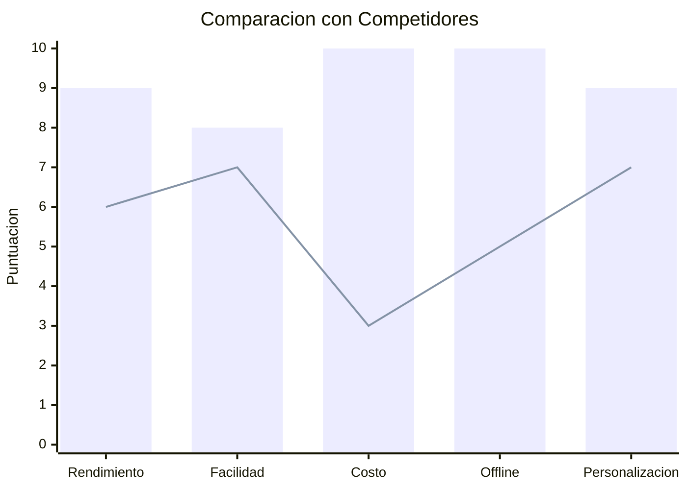

*Barras: Cubo Vision | Linea: Promedio competidores*

## 6.2 Resumen de Ventajas

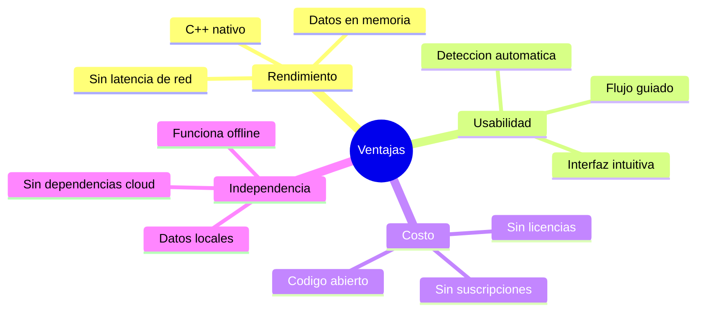

## 6.3 Resumen de Desventajas

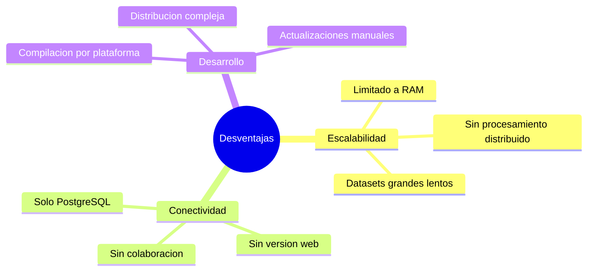

---

# 7. Conclusiones

## 7.1 Logros del Proyecto

```mermaid
timeline
    title Hitos del Desarrollo
    section Fundamentos
        Arquitectura : Definicion de capas
                     : Seleccion Qt/C++
    section Core
        Conexion BD : QtSql PostgreSQL
        Deteccion : Analizador esquema
    section Visualizacion
        Cubo 2.5D : QPainter isometrico
        Interactividad : Seleccion y zoom
    section Finalizacion
        Estadisticas : Panel analisis
        Documentacion : Manual usuario
```

## 7.2 Trabajo Futuro

```mermaid
roadmap
    title Roadmap Cubo Vision
    section 2025 Q1
        Soporte MySQL : done
        Mejoras UI : active
    section 2025 Q2
        Version Web : planned
        Colaboracion : planned
    section 2025 Q3
        IA Insights : planned
        Mobile App : planned
```

---

# Anexos

## A. Estructura de la Base de Datos de Prueba

```mermaid
erDiagram
    fact_ventas ||--o{ dim_tiempo : "FK"
    fact_ventas ||--o{ dim_geografia : "FK"
    fact_ventas ||--o{ dim_producto : "FK"
    fact_ventas ||--o{ dim_cliente : "FK"
    
    fact_ventas {
        int id_venta PK
        decimal cantidad
        decimal precio_unitario
        decimal total_venta
        decimal ganancia
        string metodo_pago
        string canal_venta
    }
    
    dim_tiempo {
        int id_tiempo PK
        date fecha UK
        int anio
        int mes
        int dia
    }
    
    dim_geografia {
        int id_geografia PK
        string pais
        string region
        string ciudad
    }
    
    dim_producto {
        int id_producto PK
        string categoria
        string subcategoria
        string marca
    }
    
    dim_cliente {
        int id_cliente PK
        string tipo_cliente
        string segmento
    }
```

## B. Glosario

| Termino | Definicion |
|---------|------------|
| OLAP | Online Analytical Processing - procesamiento analitico en linea |
| Cubo | Estructura multidimensional para analisis de datos |
| Dimension | Eje de analisis (tiempo, geografia, producto) |
| Medida | Valor numerico a analizar (ventas, cantidad) |
| Drill-down | Navegacion hacia nivel de detalle inferior |
| Drill-up | Navegacion hacia nivel de agregacion superior |
| Celda | Interseccion de dimensiones con valor de medida |
| Slice | Corte del cubo por una dimension |
| Dice | Seleccion de un subcubo |

## C. Creditos

Desarrollado como proyecto academico para la materia Base de Datos 2025.

---

*Documento generado automaticamente - Cubo Vision v1.0*
